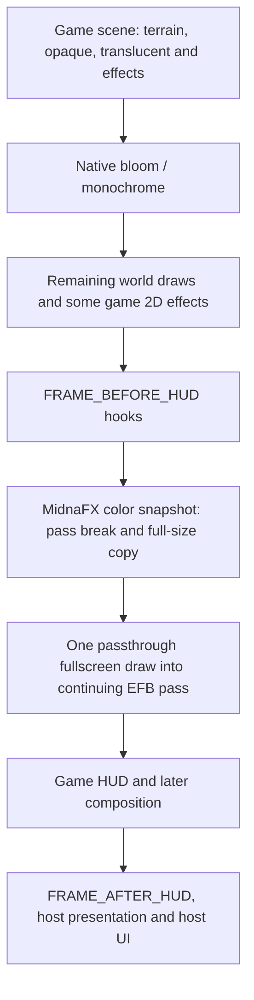

# MidnaFX M1 architecture decision

Decision date: 2026-09-16. Source baseline: Dusklight
`edf42c6a7202647b56dd2fcdef02d17671bc814b`, Aurora
`7f2801cd0133c9333eadb4e2e6b24100c328d328`. This decision precedes implementation.
See [render evidence](notes/render.md), [game evidence](notes/game.md), and
[UI evidence](notes/ui-config.md) for paths, symbols, and limitations.

## Selected integration

Use a standalone native C++20 service-only mod, `add_mod(... FEATURES webgpu)`.
Import GfxService 1.2 optionally, and use `GFX_STAGE_FRAME_BEFORE_HUD`.
Resolve color only, then enqueue one fullscreen triangle into the continuing scene pass.
WGSL uses integer pixel coordinates and `textureLoad` to preserve all four channels.
No sampler, grading uniforms, separate output texture, game ABI dependency, or environment
hooks are necessary for M1. The host already owns the snapshot and frame command stream.

This is a simplified source-traced order, not a guarantee about ordering among third-party
hooks at the same stage. Some game 2D effects precede the callback. Dawnlight's complete
visual position and installed-version compatibility require runtime testing.

## Ownership and boundaries

* `src/mod.cpp`: lifecycle, service imports, cached configuration, state-change logging.
* `src/render/renderer.*`: immutable pipeline/layout, stage and draw callbacks, diagnostics.
* `src/ui/settings.*`: host-native Mods panel with enable and optional diagnostic controls.
* `shaders/passthrough.wgsl`: the only M1 image operation; embedded at configure time.

Game-thread configuration subscriptions update booleans; no config lookup occurs on the
render worker. The stage callback resolves color and copies a small POD payload into the
host queue. The render callback calls only raw WebGPU functions using its context and owned
immutable objects. Cross-thread failure/counter publication uses atomics. UI polls cached
diagnostics only while visible; clocks are sampled only when diagnostics are enabled.

Pipeline compatibility depends on attachment formats/count, depth format and sample count,
not resolution. Resolution is taken from the current callback. A changed incompatible layout
disables rendering until reload; M1 does not race pipeline replacement against queued draws.
Disabled state returns before resolve/push/draw. Existing queued work may finish after toggle.

## Lifetime and errors

The host device outlives mods. Borrowed snapshot views are used only in their queued frame;
MidnaFX never stores them across frames. A frame-local bind group is created/released in the
draw callback, following the upstream custom rendering examples. This is a known per-frame
WebGPU object allocation, not a zero-allocation claim. A future cache requires a stronger
view-lifetime contract or an independently owned resource strategy and measurement.

The host unregisters mod draw types and drains its render worker before `mod_shutdown`.
Only then release owned WebGPU objects. No GPU queue wait is added per frame. No borrowed
device, view, queue, or encoder is released. Initialization failures keep the native settings
panel available with a disabled-render status where possible. Optional UI/config availability
degrades to logged defaults. Rendering faults latch bypass and are logged on the game thread.
WebGPU validation and actual visual neutrality still require runtime validation.

## Alternatives and extension points

Original environment overrides alone cannot provide general frame grading and couple the
mod to game ABI internals. Defer them to M6, independently switchable and supported by visual
evidence. Combined parameter overrides plus grading is a future option, not M1 scope.
Post-HUD processing unnecessarily grades text. Present interception is not a replacement of
the primary display; GfxService present-target APIs serve additional targets. Native Metal
injection duplicates Aurora portability. A zero-copy shader sampling the writable scene
attachment is unsupported feedback. Additional offscreen output adds work without M1 value.

M2 can add one uniform payload and fused arithmetic to the same shader. M3 adds preset
storage using ConfigService and HostService's persistent data directory. M5 can add isolated
game ABI integration using semantic Twilight state. No placeholder grading controls or
unverified Twilight sliders ship in M1.

## M2 implementation addendum

M2 adds a second pipeline built during initialization: the original passthrough is retained
for forced diagnostic comparison, and ordinary grading uses one fused WGSL pipeline with a
32-byte uniform block. The game thread caches a complete `grade::Prepared` value after
each configuration change. The stage callback calls `push_uniform` and passes its aligned
range in the copied draw payload; the render callback binds the current frame's snapshot
and uniform buffer. The active pipeline is selected per payload, so queued draws do not
read mutable UI settings. Fully neutral controls bypass snapshot, uniform upload and draw.
Each effect's toggle selects its neutral constant during CPU preparation, avoiding a shader
branch per effect. Parameter edits do not rebuild either pipeline.

## Performance budget

The initial basic-grading objective remains less than 0.25 ms at 3840x2160, excluding sharpening;
it is an unmeasured target. Report snapshot and draw costs separately and together. M1 makes
one snapshot request, one queued draw, and one bind-group creation per active frame. There
are no mod-owned pixel-sized allocations, no steady-state pipeline compilation and no
per-frame logging. Host snapshot memory, MSAA resolve/store behavior and bandwidth are
material costs. See `performance.md` for the measurement procedure before any speed claim.

## M3–M4 addendum

M3 stores saved looks and a separate Custom snapshot through ConfigService. Saved rows
are bounded and versioned; the UI holds the selected name and applies all eight values
and toggles on the game thread before publishing the prepared grading uniforms. Vanilla
is a built-in neutral snapshot. The host copies dropdown option labels when the saved
collection changes.

M4 keeps pipeline pairs by scene layout key. A new supported key is detected at the
pre-HUD stage; `mod_update` creates its pipelines before a later frame uses them. The
draw payload carries a pointer to the immutable pair, and pairs remain alive until
draw callbacks are drained at shutdown. Steady-state stages allocate no mod heap
objects. Optional CPU diagnostics record active and disabled callback durations in
fixed 256-sample windows and compute percentiles only on a settings-panel update.
The scene snapshot still entails a host full-size copy. GPU timing remains a target-Mac
capture task; see `performance.md`.

## M4.1–M4.2 generic shader layer

Each supported scene layout owns two shader modules and five cached render pipelines:
passthrough, one-read grade, five-read grade + detail, diagnostic grade, and diagnostic
grade + detail. The two normal entry points contain no debug-view branch. Detail is
selected only when its prepared strength is nonzero; UI strength changes update the
48-byte uniform block without compiling another pipeline. All fragment entry points
preserve the center source alpha. Debug views share the same frame-scoped snapshot and
draw, with the A/B left half returning the source before processing. The game-thread
stage chooses a pipeline and streams one immutable payload to the render worker.

The preset storage format is MFX2 with detail toggle/strength; the decoder accepts
MFX1 and assigns detail OFF. Debug view and split position are separate ConfigService
settings, not gameplay preset fields. The built-in smoke test is a developer diagnostic
look. None of these paths reads game environment state or changes native fog/geometry.
See `detail.md` and `runtime-validation.md` for algorithm and host test procedures.

## M5 prototype and M6 boundary

The `game` SDK feature imports Dusklight's game ABI epoch. `mod_update` samples
the semantic world-dark value on the game thread, treating only 1 as active
Twilight. A captured, opt-in target look and the general look are prepared
independently. A bounded CPU transition blends their grading/detail uniforms
before the existing stage publishes them; the render worker sees only the
copied frame payload. The public GfxService provides no mod-scoped native
fog/bloom ownership contract, so M6 currently has a source investigation and
validation gate rather than upstream parameter writes. See
`m5-m6-investigation.md`.

## Camera API gate

The pinned CameraService's original accepting operator replaces the native
camera controller for that tick, so MidnaFX does not use it. The candidate
CameraService 1.3 patch instead provides a post-controller vertical-FOV modifier
and a chase-controller latitude modifier. The latter changes native near/far
latitude targets before camera smoothing, eye construction, and collision.
Both MidnaFX controls are default off and require the active native chase
algorithm in mode 0. Authored event state and detached ownership fail closed.
See `camera-investigation.md` for runtime evidence and the default-on validation
boundary.
